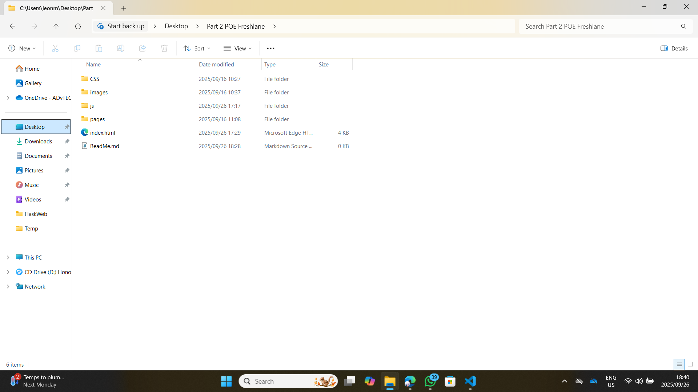
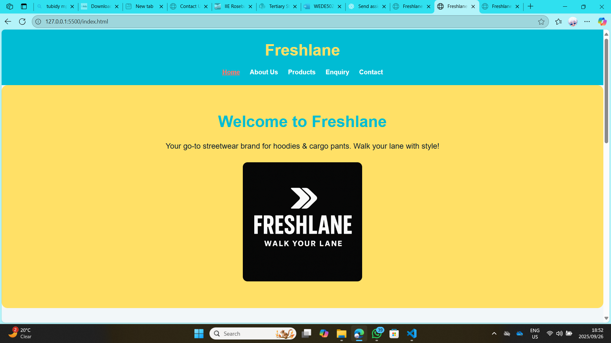
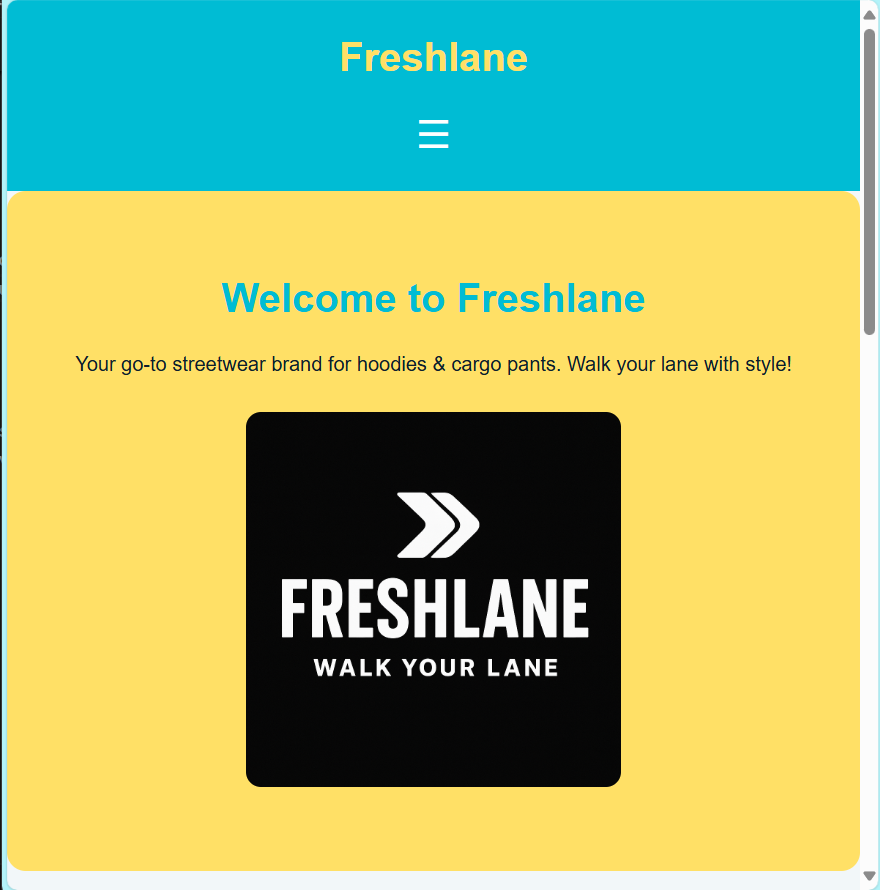

# Freshlane | Walk Your Lane

## Project Description
Freshlane is a youth-focused streetwear brand website showcasing hoodies and cargo pants. The website is fully responsive, visually appealing, and provides easy navigation for users to view products, learn about the brand, and contact the team.

---

## Folder Structure

---

## How to Run Locally
1. Clone the repository or download the ZIP file.  
2. Open `index.html` in a web browser.  
3. Navigate using the menu or the **hamburger menu** on smaller screens.  
4. Test forms, links, and map sections to confirm everything works.

---

## Website Features
- Fully responsive layout (desktop, tablet, mobile)  
- Hamburger menu for smaller screens  
- Featured products with hover effects  
- About Us page with team introduction and location map  
- Enquiry and Contact forms  
- Consistent design, typography, and colors  
- Buttons and interactive elements with hover effects  

---

## Responsive Design Evidence
Take screenshots of the following views and save them in your `screenshots` folder:

### Desktop View

### Mobile View

---

## Links
- GitHub Repository: <[text](https://github.com/Saturoleon/Freshlane-poe)>  
- Live Website: <[text](https://saturoleon.github.io/Freshlane-poe/)>

---

## References
- Angelia, H. (2023). *Web Design Essentials*. Cape Town: TechPress.  
- W3Schools. (2025). HTML & CSS. Available at: <https://www.w3schools.com> [Accessed: 26 Sep 2025].
